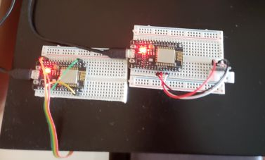
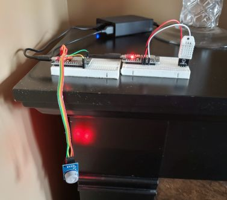
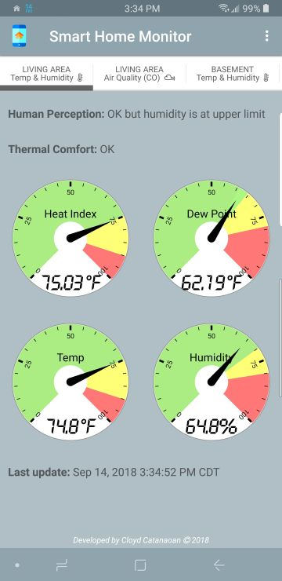
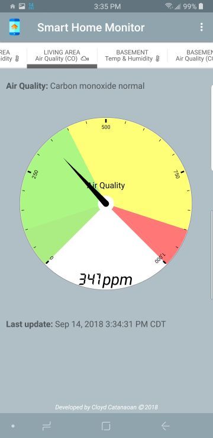
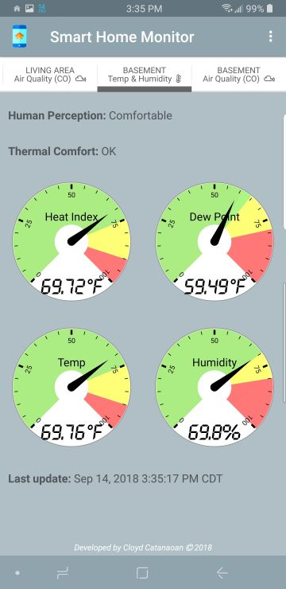
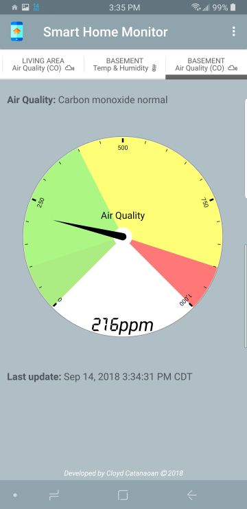
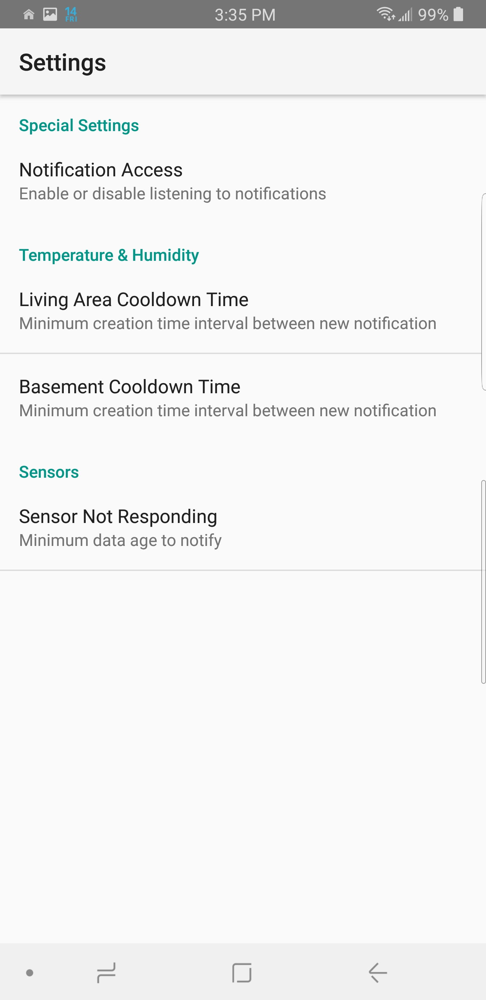
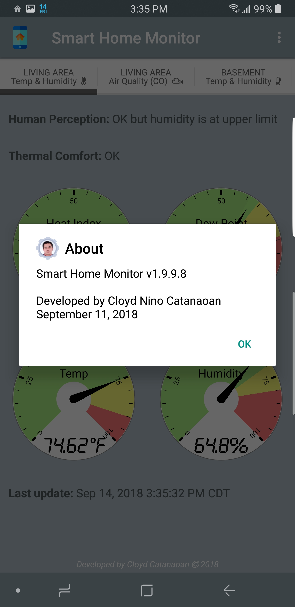
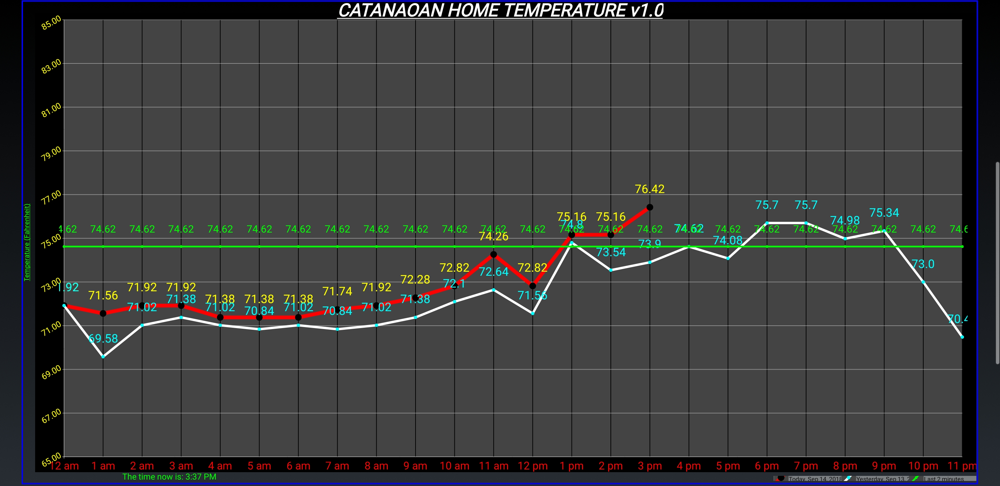

# Cloyd Smart Home Monitor System
I wrote and developed these ESP8266 programs and Android mobile application client for our home automation. The mobile application can remotely control and monitor the sensors via cloud MQTT anywhere in the world. 

I used one two pairs of ESP8266 microcontroller to power, control, and read the DHT22 and the MQ-7 sensors. The Android app and the two microcontrollers subscribe to their own topics and publish payloads (MQTT) to communicate and sync up with each other.

This project has started as a simple home weather station but turned in to a full-blown smart home monitoring system. :+1:

The ESP8266 WiFi Module is a self contained system on chip (SoC) with integrated TCP/IP protocol stack that can give any microcontroller access to the WiFi network.

### Data sent from the sensors at home to the Android mobile app via cloud MQTT
- Carbon monoxide level in parts per million (ppm)
- Air quality based on ppm level
- Temperature
- Relative humidity
- Heat index
- Dew point
- Thermal comfort:
  - Empiric comfort function based on comfort profiles(parametric lines)
  - Multiple comfort profiles possible. Default based on [Cooling/Comfort](https://c03.apogee.net/contentplayer/?coursetype=ces&utilityid=duquesnelight&id=1347)
  - Determine if it's too cold, hot, humid, dry, based on current comfort profile
  - More info at [Determining Thermal Comfort Using a Humidity and Temperature Sensor](https://www.azosensors.com/article.aspx?ArticleID=487)
- Human perception based on humidity, temperature and dew point according to Horstmeyer, Steve (2006-08-15). [Relative Humidity....Relative to What? The Dew Point Temperature...a better approach](http://www.shorstmeyer.com/wxfaqs/humidity/humidity.html)

### Hardware used for Internet of Things (IoT):
* NodeMcu LUA WIFI Board Based on ESP8266 CP2102 Module
* DHT22 (AM2302) Temperature & Humidity Sensor Module
* MQ-7 Carbon Monoxide Sensor
* Wyze Cam V2 and Pan PTZ

### Mobile application and protocols used for Internet of Things (IoT):
- Custom-made Android mobile application
- Cloud MQTT

### Hardware images:
Description | Image
--------|------
Powerful ESP8266 |  
MQ7 (Carbon monoxide) and DHT22 (Temp & humidity) sensors | 

### Android application images:

Samsung Galaxy Note 9 Screenshots | Samsung Galaxy Note 9 Screenshots
--------|------
 |  
 |  
 |  

